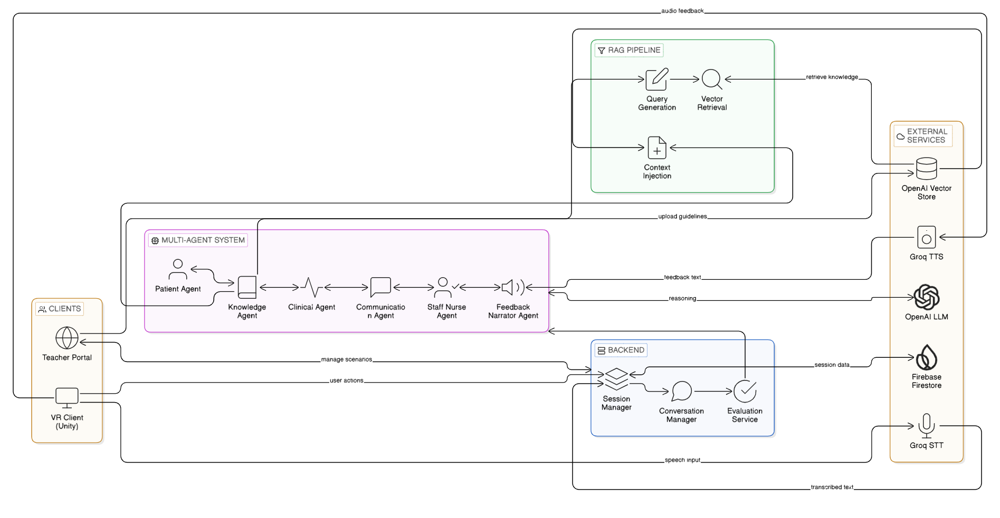

# Multi-Agent LLM Framework for Automated Feedback in VR Nursing Training

#### Team
- E/20/243, Malintha K.M.K., [e20243@eng.pdn.ac.lk](mailto:e20243@eng.pdn.ac.lk)
- E/20/100, Fernando A.I., [e20100@eng.pdn.ac.lk](mailto:e20100@eng.pdn.ac.lk)
- E/20/434, Wickramaarachchi P.A., [e20434@eng.pdn.ac.lk](mailto:e20434@eng.pdn.ac.lk)

#### Supervisors
- Mrs. Yasodha Vimukthi, [yasodhav@eng.pdn.ac.lk](mailto:yasodhav@eng.pdn.ac.lk)
- Dr. Upul Jayasinghe, [upuljm@eng.pdn.ac.lk](mailto:upuljm@eng.pdn.ac.lk)

#### Table of Contents
1. [Abstract](#abstract)
2. [Related Works](#related-works)
3. [Methodology](#methodology)
4. [Experiment Setup and Implementation](#experiment-setup-and-implementation)
5. [Results and Analysis](#results-and-analysis)
6. [Conclusion](#conclusion)
7. [Publications](#publications)
8. [Links](#links)

---

## Abstract

Automated evaluation in virtual reality (VR)-based nursing education presents significant challenges in providing clinically accurate and pedagogically sound feedback comparable to expert nurse assessments. Current AI-driven evaluation systems often lack reliability, transparency, and alignment with established nursing competency frameworks, limiting their effectiveness in high-stakes educational settings.

This project presents a **multi-agent Large Language Model (LLM) framework** that delivers automated, real-time, clinically grounded feedback to nursing students practising post-operative wound care procedures in a VR simulation environment. Rather than relying on a single monolithic LLM, the system deploys six specialised AI agents — each evaluating a distinct dimension of nursing competence simultaneously — whose outputs are aggregated and synthesised into formative feedback delivered by voice inside the VR headset.

A key architectural contribution is the **hybrid deterministic and LLM design**: safety-critical procedural pass/fail decisions are governed by hardcoded prerequisite logic, while the LLM is used exclusively for educational explanation and feedback narration. All agent feedback is grounded in verified clinical guidelines through a Retrieval-Augmented Generation (RAG) pipeline using OpenAI Vector Stores, preventing hallucination of clinical advice. The system further adapts its evaluation criteria, scoring rubrics, and feedback tone based on patient-specific risk factors such as Type 2 Diabetes Mellitus.

The platform was evaluated across six pillars: deterministic logic unit testing, API integration testing, AI agent quality assessment using a golden dataset and LLM-as-judge rubric, real-time latency profiling, fault injection reliability testing, and speech interface accuracy measurement. Results demonstrate 100% pass rates on unit and reliability tests, a Knowledge Agent F1 score of 0.94, Communication Agent verdict accuracy of 1.00, and speech-to-text Word Error Rate of 0.13 at sub-second latency. A dedicated Teacher Portal enables clinical educators to manage scenarios, expand the RAG knowledge base, and review detailed per-session student performance logs without developer involvement.

---

## Related Works

The development of this system is grounded in a comprehensive review of 40 papers synthesising four primary AI refinement paradigms applicable to automated nursing education evaluators.

### VR and LLM-Powered Clinical Training

Virtual Reality has emerged as a powerful alternative to traditional standardised patient (SP) training, offering scalable, safe, and repeatable clinical simulation environments. Frameworks such as the Simulation-based Training Framework (STF) demonstrate that integrating immersive technology with AI feedback significantly improves student focus and learning outcomes. LLM-powered virtual patient agents enable realistic, adaptive dialogue that scales beyond the scripted interactions of traditional SPs, and embodied conversational agents (ECAs) have been specifically designed to train clinical communication skills in VR.

### The Challenge of Reliable Automated Evaluation

The integration of LLMs for automated evaluation introduces critical reliability challenges. Raw LLMs are prone to hallucination — generating clinically imprecise or incorrect feedback — and can exhibit biases present in training data that lead to unfair assessments. Performance on general language tasks does not predict performance on specialised clinical evaluation, as demonstrated by benchmarks such as MED-HALT. Feedback must align with established nursing competency frameworks encompassing technical skills, critical thinking, therapeutic communication, and professional values.

### Four Refinement Paradigms

The literature identifies four primary methodologies for refining LLM-based evaluators:

**Multi-Agent Systems** move from a single monolithic LLM to collaborative architectures where specialised agents evaluate distinct competency dimensions and reach consensus, mimicking a panel of human experts. This approach reduces individual agent bias and handles the interdependencies inherent in realistic clinical scenarios.

**Reinforcement Learning from Human Feedback (RLHF)** directly integrates expert clinical judgment into the AI training process through iterative refinement cycles, aligning model outputs with domain-specific professional standards. Reinforcement Learning from AI Feedback (RLAIF) offers a scalable complement, though RLHF remains resource-intensive.

**Metrics-Based Validation** grounds AI evaluation in objective, standardised clinical assessment criteria such as OSATS scales, domain-specific benchmarks, and established nursing competency frameworks. This approach ensures that automated evaluators are measurable against the same rigorous standards as human assessors, including requirements for explainability and compliance with trustworthy AI principles.

**Hybrid and Adaptive Systems** synthesise the three approaches above into integrated solutions. The Adaptive-VP framework and STF demonstrate that combining RAG-grounded feedback, multi-agent evaluation, RLHF-based alignment, and metrics-based validation produces systems that are simultaneously reliable, adaptive, and pedagogically sound — the approach recommended for high-stakes clinical education.

The synthesis of this literature directly motivated this project's core design decisions: a multi-agent architecture for specialised evaluation, RAG for clinical grounding, deterministic logic for safety-critical decisions, and a metrics-based scoring rubric aligned with nursing competency frameworks.

---

## Methodology

### System Architecture

The system comprises a FastAPI backend connected to a Unity VR client via REST APIs and WebSockets. Six specialised agents, a RAG pipeline, a real-time audio pipeline, and a teacher portal operate as distinct subsystems coordinated by a central evaluation service.

### The Three-Step Clinical Workflow

Student training sessions follow a strict linear state machine — steps must be completed in order:

| Step | Description |
|---|---|
| **History Taking** | Student interviews the virtual AI patient using voice or text, gathering clinical history |
| **Wound Assessment** | Student answers MCQs about the wound shown in VR |
| **Cleaning & Dressing Preparation** | Student performs nine sequential preparation actions in the VR environment |

### The Six-Agent Multi-Agent Framework

Each agent is a subclass of a shared `BaseAgent` wrapping the OpenAI Responses API:

| Agent | Role |
|---|---|
| **Patient Agent** | Simulates the virtual patient; responses strictly grounded in scenario data |
| **Staff Nurse Agent** | Conversational supervising nurse; guidance mode and material verification mode |
| **Knowledge Agent** | RAG-grounded checklist evaluation of history-taking transcript; contributes 60% of History score |
| **Communication Agent** | Evaluates communication quality — empathy, questioning style, turn count; contributes 40% of History score |
| **Clinical Agent** | Hybrid deterministic + LLM: pass/fail via hardcoded prerequisite map; LLM used only for clinical explanation |
| **Feedback Narrator Agent** | Synthesises all agent outputs into one supportive student-facing paragraph |

### Hybrid Deterministic and LLM Design

The Clinical Agent embodies the key safety design decision of the system. All nine wound preparation actions have a hardcoded prerequisite map — if a student attempts an action before completing its prerequisites, the system blocks it deterministically without any LLM involvement. The LLM is invoked only when a prerequisite violation occurs, to explain *why* the missing steps matter clinically, personalised to the patient's risk profile. This prevents hallucination in safety-critical pass/fail verdicts while preserving educational explanation quality.

### RAG Pipeline

All AI feedback is grounded in three embedded clinical guideline documents via OpenAI Vector Stores: Diabetic Wound Care Guidelines, History Taking Evaluation Guidelines, and Wound Cleaning and Dressing Evaluation Guidelines. For each evaluation, the system generates a dynamic semantic query from the current step context, retrieves the most relevant guideline passages, and injects them into the agent's system prompt before generating feedback.

### Teacher Portal

A fully decoupled backend subsystem under the `/teacher` API prefix gives clinical educators runtime control over:
- **Scenario management** — create, update, list, and retrieve clinical scenarios via REST endpoints with full Pydantic schema validation and MCQ integrity checking
- **Knowledge base expansion** — upload `.txt` clinical guideline files directly to the OpenAI Vector Store; new content is immediately available to all RAG-grounded agents
- **Student performance monitoring** — per-session logs with full history transcripts, MCQ breakdowns, action timelines with prerequisite violation flags, and automatically generated plain-English critical safety concerns

---

## Experiment Setup and Implementation

### Technology Stack

| Layer | Technology |
|---|---|
| Backend framework | FastAPI (Python 3.11) |
| LLM engine | OpenAI GPT (Responses API) |
| RAG / Vector Store | OpenAI Vector Stores |
| Speech-to-Text | Groq Whisper Large v3 |
| Text-to-Speech | Groq Orpheus v1 English |
| Database | Firebase Firestore |
| Real-time communication | WebSockets |
| VR application | Unity |
| Teacher portal frontend | React + Vite |
| Testing framework | pytest + FastAPI TestClient |

### Clinical Scenarios

Two scenarios were implemented for evaluation:

- **Scenario 001** — Post-operative clean surgical wound, left forearm, 52-year-old male with hypertension, Penicillin and Latex allergies
- **Scenario 002** — Wound care with Type 2 Diabetes Mellitus — elevated infection risk, impaired healing, additional risk factor assessment required

### Evaluation Framework

The system was evaluated across six complementary pillars:

**Pillar 1 — Unit Testing:** pytest was used to test all deterministic components — state machine (6 tests), MCQ evaluator (6 tests), scoring engine (4 tests), Clinical Agent prerequisite logic (3 tests), and Communication Agent heuristics (3 tests).

**Pillar 2 — Integration Testing:** FastAPI TestClient simulated complete session lifecycles, REST endpoint validation, WebSocket communication, RAG retriever pipeline, and student log persistence across 37 test cases.

**Pillar 3 — AI Agent Evaluation:** A golden dataset of synthetic nursing transcripts with known ground truth labels was used to evaluate the Knowledge Agent (Precision, Recall, F1) and Communication Agent (verdict accuracy, consistency rate across repeated runs). The Feedback Narrator Agent was evaluated using an LLM-as-judge rubric scoring clinical accuracy, clarity, completeness, tone, and contextual relevance on a 1–5 scale.

**Pillar 4 — Performance Testing:** End-to-end latency was measured using `time.perf_counter()` across 20 iterations per operation, reporting P50 and P95 values for all major system operations.

**Pillar 5 — Reliability Testing:** Fault injection via mocked external APIs simulated failures of the OpenAI LLM API, OpenAI Vector Store, Firebase Firestore, and WebSocket connections. Recovery behaviour and fallback mechanisms were validated for each scenario.

**Pillar 6 — Speech Interface Evaluation:** STT accuracy was measured as Word Error Rate (WER) across 12 recorded nursing dialogue samples under clean, moderate-noise, and heavy-noise conditions. TTS intelligibility was assessed via a round-trip test: text → TTS → audio → STT → compared to original.

---

## Results and Analysis

### Unit and Integration Testing

All 22 unit tests passed with a 100% pass rate, confirming that all deterministic components produce correct and reproducible outputs for identical inputs. All 37 integration tests passed, validating end-to-end API behaviour, response schema correctness, and full session lifecycle completion.

### AI Agent Evaluation

| Agent | Metric | Result |
|---|---|---|
| Knowledge Agent | Precision | 0.96 |
| Knowledge Agent | Recall | 0.93 |
| Knowledge Agent | F1 Score | 0.94 |
| Communication Agent | Verdict Accuracy | 1.00 |
| Communication Agent | Consistency Rate | 95% |

The Knowledge Agent demonstrates high clinical checklist detection accuracy with minimal false positives or false negatives. The Communication Agent achieves perfect verdict accuracy on the golden dataset; the 5% inconsistency rate on repeated runs reflects the inherent non-determinism of LLM-based evaluation on borderline transcripts — an expected and documented limitation of this approach.

### Performance

| Operation | P50 Latency | P95 Latency |
|---|---|---|
| Patient response generation (LLM + TTS) | 7.09s | 9.56s |
| Action validation (Clinical Agent) | ~0.00s | ~0.00s |
| Nurse verification response | 4.89s | 6.38s |
| History evaluation pipeline (RAG + 2 agents + narration) | 77.54s | 88.60s |
| MCQ evaluation (deterministic) | ~0.00s | ~0.00s |
| Session creation | 0.67s | 1.03s |
| Firestore log write | 2.01s | 2.25s |

Deterministic operations (MCQ evaluation, action validation) are near-instantaneous. The history evaluation pipeline latency of 77.54s at P50 reflects the sequential chaining of RAG retrieval, two LLM agent calls, and feedback narration — each involving external API round trips. This operation occurs once per step at a natural transition point rather than during live interaction, making it acceptable for a formative feedback context. Reducing this through parallelisation of agent calls is identified as a key target for future optimisation.

### Reliability

| Metric | Result |
|---|---|
| Recovery Rate | 100% |
| System Crashes | 0 |
| Unhandled Errors | 0 |

All four injected failure scenarios — LLM API failure, vector store failure, Firestore write failure, and WebSocket disconnection — were handled gracefully through agent-level fallbacks and session state preservation. No cascading failures were observed.

### Speech Interface

| Metric | Result |
|---|---|
| STT Average WER (clean audio) | 0.13 |
| STT Latency P50 | 0.67s |
| STT Latency P95 | 0.89s |
| TTS Latency P50 | 0.82s |
| TTS Latency P95 | 0.98s |
| TTS Round-Trip WER | 0.13 |

The average STT WER of 0.13 indicates high transcription accuracy suitable for clinical conversation. Noise robustness testing showed WER increasing under heavy noise conditions, with earlier audio samples most affected. TTS round-trip WER matching the STT baseline confirms that Groq Orpheus-generated speech is sufficiently intelligible for the STT service to transcribe accurately, validating the end-to-end voice interaction pipeline for VR use.

---

## Conclusion

This project demonstrates that a hybrid multi-agent LLM framework is a viable and clinically safe approach to automated feedback in VR-based nursing education. The core finding aligns with the literature review's central argument: unrefined monolithic LLMs are insufficient for high-stakes clinical evaluation. The solution lies in carefully architected systems that are collaborative by design, grounded by RAG, and safe by determinism.

The six-agent framework successfully decomposes nursing competence evaluation into specialised dimensions — clinical knowledge, communication quality, procedural safety, and educational feedback synthesis — and achieves strong quantitative results across all evaluation pillars. The hybrid deterministic and LLM design for the Clinical Agent demonstrates that it is possible to preserve the educational value of natural language explanation while eliminating LLM involvement from safety-critical pass/fail decisions.

Key contributions of this work include: a reproducible multi-agent evaluation architecture transferable to other clinical nursing domains; a RAG-grounded feedback pipeline that prevents hallucination of clinical advice; a scenario-adaptive system that adjusts evaluation criteria and feedback tone to patient risk factors; and a teacher portal that decouples content management and student performance monitoring from the student-facing runtime.

**Limitations** include the high end-of-step evaluation latency driven by sequential external API calls, the 5% LLM consistency gap in the Communication Agent on borderline transcripts, current support for only two wound care scenarios, and the absence of longitudinal student performance tracking. These are identified as primary targets for future work.

**Future directions** include parallelisation of agent LLM calls to reduce history evaluation latency, expansion to additional nursing procedures (medication administration, IV cannulation), adaptive scenario difficulty scaling with student performance, fine-tuned clinical nursing models to reduce external API dependency, and formal user studies with nursing students and clinical educators to validate pedagogical effectiveness against human supervisor benchmarks.

---

## Links

- [Project Repository](https://github.com/cepdnaclk/e20-4yp-Multi-Agent-LLM-Framework-for-Automated-Feedback-in-VR-Nursing-Training)
- [Project Page](https://cepdnaclk.github.io/e20-4yp-Multi-Agent-LLM-Framework-for-Automated-Feedback-in-VR-Nursing-Training)
- [Unity VR Application](https://github.com/kushanmalintha/FYP-WoundCareSim-Unity.git)
- [Department of Computer Engineering](http://www.ce.pdn.ac.lk/)
- [University of Peradeniya](https://eng.pdn.ac.lk/)
